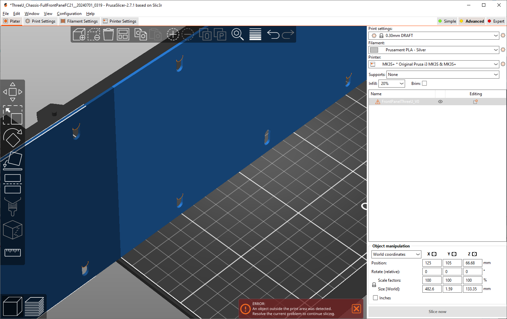
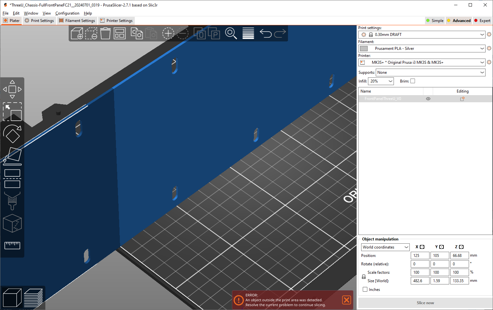
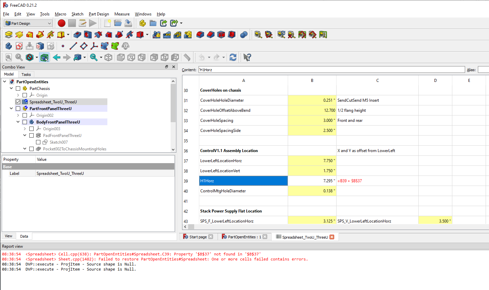
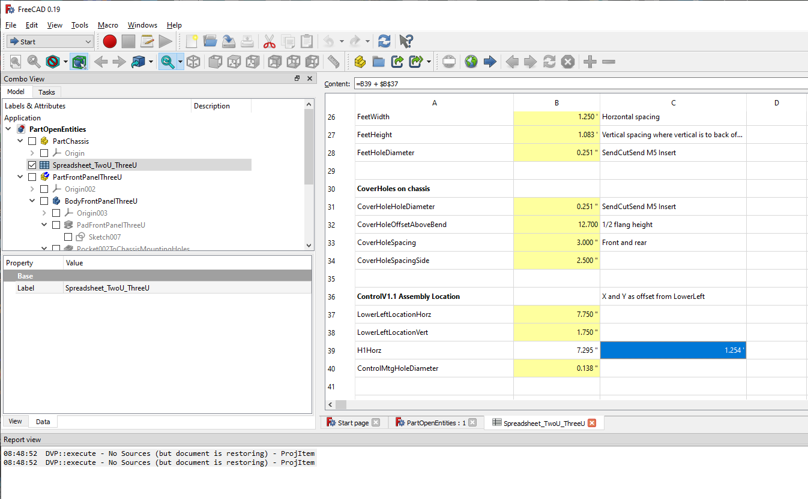

# These files
This file created by copying ThreeU_Chassis.FCStd on 20240703 at 8:30 AM.

> commit 70e592dbd0b34e8595b7c6679b5a5075631329c1 (HEAD -> Enclosure3UAssy)
> Author: Forrest Erickson <forresterickson@comcast.net>
> Date:   Mon Jul 1 21:40:07 2024 -0400
> 
>     Still trying and failing to clear front panel hole errors when rack mount holes added.

## Reproducing the problem

### Problem in V0.19
Then, using V0.19 delete all Parts and Bodies but the PartFrontPanelThreeU and the Part Chassis.
Save file.
Export a STEP file and open in PursaSlicer and capture screen shot showing the error.

### No Problem on STEP on V0.21
Then, using V0.21 open the file. Select the PartFrontPanelThreeU body.
Export a STEP file and open in PursaSlicer and capture screen shot showing the no error.  

## Report View Errors on V0.21

However on opening the file in V 0.21 the Report View shoes an error in the spread sheet.
  
08:38:54  <Spreadsheet> Cell.cpp(638): PartOpenEntities#Spreadsheet.C39: Property '$B$37' not found in '$B$37'
08:38:54  <Spreadsheet> Sheet.cpp(1482): Failed to restore PartOpenEntities#Spreadsheet: One or more cells failed contains errors.
08:38:54  DVP::execute - ProjItem - Source shape is Null.
08:38:54  DVP::execute - ProjItem - Source shape is Null.

And there is an error in cell C39 reported.

There is no such error on cell C39 when open in V0.19

## Fix formula in C39
In V0.21 I fixed the formula in C39 and saved a new file: PartOpenEntitiesFixC39.FCStd
I closed FreeCAD and then reopened FreeCAD V0.21 and opened the file and no error was reported.
The Report View returned these two lines

08:59:29  DVP::execute - ProjItem - Source shape is Null.
08:59:29  DVP::execute - ProjItem - Source shape is Null.

